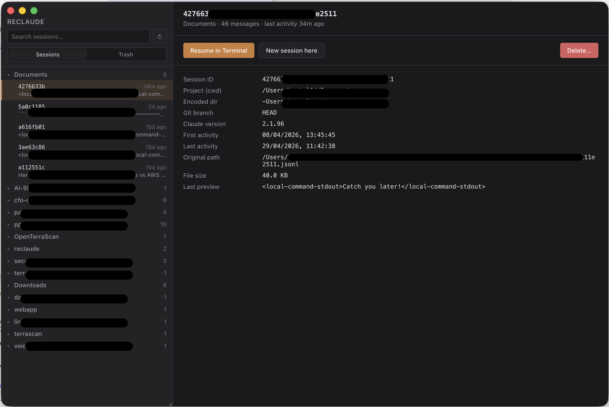

# 🪄 Reclaude

> **A native, lightning-fast desktop session manager for [Claude Code](https://claude.ai/code).**
> Browse every session you've ever run. Search them. Resume one in your terminal with a double-click.

<p align="center">
  
</p>

<p align="center">
  
  
  
  
  
</p>

---

## ✨ Why Reclaude?

If you live in Claude Code, you accumulate hundreds of conversation files under `~/.claude/projects/`. Finding "that one session from last Tuesday where I figured out the auth bug" is painful — they're encoded paths, UUIDs, and JSONL.

Reclaude turns that pile into a tidy desktop browser:

- 🌳 **Sidebar tree** — every project that has Claude Code sessions, grouped under its `cwd`. Counts at a glance.
- 🖱️ **Double-click → resume** in your **native terminal**, running `claude --resume <id>` from the original cwd. Multiple sessions side-by-side, no problem.
- 🔎 **FTS5 full-text search** — across previews, project paths, and git branches. Type-as-you-go.
- 🗑️ **Soft-delete with a 7-day Trash** — one-click Undo from the toast; restore or purge from the Trash tab; auto-cleanup after a week.
- 👻 **Orphan badge** for projects whose `cwd` no longer exists on disk.
- 🔄 **Live file watcher** (chokidar) keeps the UI in sync as new sessions appear.
- ⏰ **Background reindex every 3 hours** via a platform-native scheduler — `launchd` on macOS, Task Scheduler on Windows, `systemd --user` on Linux.
- ⚡ **Two-stage incremental indexer** — `stat`-based fingerprint, then targeted head/tail JSONL parse only for changed files. Steady-state reindex of thousands of sessions completes in tens of milliseconds.

---

## 🛡️ Security posture

Reclaude takes the "Electron is a footgun" critique seriously and is hardened accordingly:

- 🔒 Strict Electron sandbox (`sandbox: true`, `contextIsolation: true`, `nodeIntegration: false`, `webviewTag: false`)
- 🧱 Full Electron Fuses block (`runAsNode: false`, ASAR integrity validation, `onlyLoadAppFromAsar`, no `NODE_OPTIONS`/CLI inspect)
- 🎯 IPC sender pin — every IPC handler exact-matches the renderer URL via `pathToFileURL`
- 🛂 Content-Security-Policy `default-src 'self'`; no `unsafe-eval` outside dev mode
- 🌳 Symlink-resolved containment (`fs.realpathSync`) on every path that touches the JSONL trust boundary
- 📜 Tamper-evident audit log (mode 0o600, control-char sanitization, 3-generation rotation) for every destructive IPC
- 🍎 macOS hardened runtime + minimal entitlements (only `com.apple.security.automation.apple-events` for Terminal.app); `afterSign` hook drives notarization when creds are present
- 📦 All direct npm deps pinned exact; `npm audit` reports **0 vulnerabilities**

The full review trail (threat model, code review, architecture review) lives under `.paranoids/` if you'd like to see how it was put together.

---

## 📋 Prerequisites

Native modules (`better-sqlite3`) compile against Electron's ABI on first install via `electron-rebuild`, so you need a working C/C++ toolchain on every platform.

### 🌍 All platforms

- **Node.js 20+** (Node 22 / 24 also fine)
- **npm 10+**
- **Git**
- **Claude Code CLI** on `PATH` — verify with `claude --version`. Without it, the "Resume in Terminal" button opens a terminal that immediately errors.

### 🍎 macOS

- **Xcode Command Line Tools** — `xcode-select --install`
- **Python 3** (ships with the CLT)

### 🪟 Windows &nbsp;🚧

> [!WARNING]
> **Windows support is implemented but not personally tested by the maintainer.** The code paths exist (Task Scheduler, `wt.exe`/`cmd.exe`, NSIS installer) and are designed to work, but they haven't been verified end-to-end on a real Windows machine. PRs and bug reports from Windows users are very welcome.

- **Visual Studio Build Tools 2022** with the **"Desktop development with C++"** workload.
- **Python 3** on `PATH`.
- Recommended terminal: **Windows Terminal** (`wt.exe`). Reclaude falls back to `cmd.exe` if `wt` isn't found.

### 🐧 Linux &nbsp;🚧

> [!WARNING]
> **Linux support is implemented but not personally tested by the maintainer.** systemd-user timer, AppImage packaging, and the terminal-emulator probe (gnome-terminal/konsole/xfce4/xterm) are all wired up but unverified on a real Linux desktop. Confirmation reports from Linux users would be hugely appreciated.

- `build-essential` (Debian/Ubuntu) or `Development Tools` group (Fedora/RHEL)
  - Debian/Ubuntu: `sudo apt install -y build-essential python3 git`
  - Fedora/RHEL: `sudo dnf install -y @"Development Tools" python3 git`
- A terminal emulator on `PATH` — Reclaude probes for `x-terminal-emulator`, `gnome-terminal`, `konsole`, `xfce4-terminal`, `xterm` in that order.
- For AppImage runtime: `libfuse2` (Ubuntu 22+: `sudo apt install -y libfuse2`).

---

## 🚀 Install & run (development)

```bash
git clone <repo-url> reclaude
cd reclaude
npm install            # postinstall runs electron-rebuild for better-sqlite3
npm run dev            # starts Vite on :5173 and Electron together
```

If you ever see a `NODE_MODULE_VERSION` mismatch (after Node or Electron upgrades), rebuild the native module:

```bash
npm run rebuild
```

Wipe build artifacts and start clean:

```bash
npm run clean
```

---

## 📦 Build production artifacts

All commands produce installers/packages under `release/`.

### 🔐 Release-build prerequisites

For any artifact you intend to ship to other people:

- **Use `npm ci`, not `npm install`** in CI / release pipelines. `npm ci` honours the lockfile exactly and refuses to mutate it; `npm install` will silently bump pinned versions if a transitive dep ships a new minor. All direct deps in `package.json` are pinned to exact versions for the same reason.
- **macOS notarization** is wired through `scripts/notarize.js` (an `afterSign` hook). It runs only when `APPLE_ID`, `APPLE_APP_SPECIFIC_PASSWORD`, and `APPLE_TEAM_ID` are set — without them, the `.app` ships unsigned and is blocked by Gatekeeper. Set `SKIP_NOTARIZATION=1` to opt out explicitly. ASAR integrity (`enableEmbeddedAsarIntegrityValidation`) is configured but only meaningful when paired with a code-signed binary.
- **Windows code signing** requires a `.pfx` certificate via `CSC_LINK` and `CSC_KEY_PASSWORD`. Without it, the NSIS installer triggers SmartScreen warnings. The `afterSign` hook also runs `signtool /verify` on each output `.exe` and fails the build if the signature is invalid; set `SKIP_CODESIGN=1` to opt out for unsigned dev builds.
- **Bypass the postinstall script in CI** with `npm ci --ignore-scripts`, then run `npm run rebuild` separately as a verified, isolated step. This prevents a future compromised package from gaining native-code execution during install.

### 🍎 macOS — DMG &nbsp;✅

```bash
npm run dist -- --mac
```

- Default target: `dmg`.
- To produce a universal binary for both Apple Silicon and Intel:
  ```bash
  npm run build && npx electron-builder --mac --x64 --arm64
  ```
- **Code signing & notarization** (recommended for distribution):
  ```bash
  export CSC_LINK=/path/to/cert.p12
  export CSC_KEY_PASSWORD='…'
  export APPLE_ID='you@apple.id'
  export APPLE_APP_SPECIFIC_PASSWORD='abcd-efgh-ijkl-mnop'
  export APPLE_TEAM_ID='ABCD123456'
  npm run dist -- --mac
  ```
- **Without signing**: the DMG installs fine, but Gatekeeper blocks first launch. Right-click the app → **Open** → confirm in the warning dialog. Do this once per machine.

### 🪟 Windows — NSIS installer (`.exe`) &nbsp;🚧 _untested_

> [!NOTE]
> The Windows build pipeline is wired but the maintainer has not personally produced or run a Windows installer. The instructions below are how it _should_ work; please open an issue if anything fails on a real Windows host.

```bash
npm run dist -- --win
```

- Default target: `nsis`.
- x64 by default; for ARM64, add `--arm64` and configure `electron-builder` accordingly.
- **Code signing** (optional): set `CSC_LINK` and `CSC_KEY_PASSWORD` to your `.pfx`. Without signing, SmartScreen warns on first run; click **More info** → **Run anyway**.
- Cross-building from macOS/Linux works for unsigned artifacts; signing must happen on a Windows host (or via a separate signing pipeline).

### 🐧 Linux — AppImage (default), `.deb`, `.rpm` &nbsp;🚧 _untested_

> [!NOTE]
> Same caveat as Windows: the Linux build pipeline is implemented but unverified on a real desktop Linux installation. Output artifact format, terminal-emulator probe, and systemd unit are all assumed-correct based on `electron-builder` defaults and standard Linux conventions.

```bash
npm run dist -- --linux
```

- Default target: `AppImage`. To produce more formats, edit `package.json` → `build.linux.target`:
  ```json
  "linux": {
    "target": ["AppImage", "deb", "rpm"],
    "category": "Development"
  }
  ```
- Run an AppImage:
  ```bash
  chmod +x release/Reclaude-*.AppImage
  ./release/Reclaude-*.AppImage
  ```
- `.deb`: `sudo apt install ./release/reclaude_*.deb`
- `.rpm`: `sudo rpm -i ./release/reclaude-*.rpm`

### 🎯 Build all three from one command

```bash
npm run dist           # invokes electron-builder --mac --win --linux
```

Caveat: `--mac` works fully (signed/notarized) only on macOS hosts. On Linux/Windows hosts, the macOS build will fail unless you drop the `--mac` flag.

---

## ⏰ Background indexer (3-hour reindex)

The app installs a platform-native scheduler that periodically launches the app in headless mode (`RECLAUDE_HEADLESS=1`), reindexes `~/.claude/projects/`, purges expired trash, and exits.

The install/uninstall logic is exposed on IPC channels:

- `scheduler:install` — registers the OS scheduler entry
- `scheduler:uninstall` — removes it
- `scheduler:status` — returns `{ installed: boolean }`

A future Settings UI will expose these as a toggle. For now you can call them from the renderer DevTools console:

```js
await window.reclaude.schedulerInstall();
await window.reclaude.schedulerStatus();
```

What gets installed where:

| OS         | Where                                                          | What                                            |
| ---------- | -------------------------------------------------------------- | ----------------------------------------------- |
| 🍎 macOS   | `~/Library/LaunchAgents/com.reclaude.indexer.plist`            | `launchd` LaunchAgent, `StartInterval=10800`    |
| 🪟 Windows _(untested)_ | Task Scheduler entry `ReclaudeIndexer`            | Hourly trigger with `/MO 3`                     |
| 🐧 Linux _(untested)_   | `~/.config/systemd/user/reclaude-indexer.{service,timer}` | systemd user `.timer`, `OnUnitActiveSec=3h` |

Logs:

- 🍎 macOS: `~/Library/Application Support/Reclaude/logs/indexer.{out,err}.log`
- 🪟 Windows: `%APPDATA%\Reclaude\logs\`
- 🐧 Linux: `~/.config/Reclaude/logs/`

---

## 🔁 Migrating from a previous ClaudeDeck install

If you ran an earlier build under the old name **ClaudeDeck**, it left behind:

- A user-data directory at `~/Library/Application Support/ClaudeDeck/` (macOS) — Reclaude uses a fresh `Reclaude/` directory, so the old DB and trash become orphaned but harmless.
- A LaunchAgent plist at `~/Library/LaunchAgents/com.claudedeck.indexer.plist` (macOS), a Task Scheduler entry `ClaudeDeckIndexer` (Windows), or systemd units `claudedeck-indexer.{service,timer}` (Linux).

Clean up once:

```bash
# 🍎 macOS
launchctl bootout gui/$(id -u) ~/Library/LaunchAgents/com.claudedeck.indexer.plist 2>/dev/null
rm -f ~/Library/LaunchAgents/com.claudedeck.indexer.plist
rm -rf "$HOME/Library/Application Support/ClaudeDeck"
```

```powershell
# 🪟 Windows
schtasks /Delete /TN ClaudeDeckIndexer /F
Remove-Item -Recurse -Force "$env:APPDATA\ClaudeDeck"
```

```bash
# 🐧 Linux
systemctl --user disable --now claudedeck-indexer.timer
rm -f ~/.config/systemd/user/claudedeck-indexer.{service,timer}
systemctl --user daemon-reload
rm -rf ~/.config/Reclaude  # safe; recreated on next launch
```

The new app rebuilds its index from `~/.claude/projects/` on first launch.

---

## 🛠️ Troubleshooting

**❌ `NODE_MODULE_VERSION X requires NODE_MODULE_VERSION Y`**

Native module ABI mismatch between Node and Electron. Fix:
```bash
npm run rebuild
```

**❌ `claude: command not found` when resuming**

The "Resume in Terminal" feature spawns a terminal that runs `claude --resume <id>`. If `claude` isn't on the PATH inside that terminal's login shell, the resume will fail. Verify with `which claude` (macOS/Linux) or `where claude` (Windows). If it resolves only inside `nvm`/`fnm`/etc., make sure your shell rc initializes the version manager.

**🍎 macOS: "App is damaged and can't be opened"**

Unsigned DMG. Bypass once via:
```bash
xattr -dr com.apple.quarantine "/Applications/Reclaude.app"
```

**🪟 Windows: "Windows protected your PC"**

Unsigned installer. Click **More info** → **Run anyway**, or use a code-signing certificate.

**🐧 Linux: AppImage won't launch**

Install FUSE 2: `sudo apt install -y libfuse2` (Ubuntu 22+) or `sudo dnf install -y fuse-libs` (Fedora).

**🗑️ Trash tab shows empty after deleting a session**

Fixed in the current version — the file watcher used to scrub the row immediately. If you still see this, rebuild from a fresh checkout.

**🔄 Sessions don't refresh after a deletion in the file system**

Force a reindex via the ↻ button in the sidebar header, or use the renderer DevTools console:
```js
await window.reclaude.reindex();
```

---

## 📁 Project layout

```
electron/        Main process (TypeScript → CommonJS in dist-electron/)
  main.ts        App lifecycle, headless --reindex mode
  preload.ts     contextBridge surface (window.reclaude)
  ipc.ts         IPC handlers (guard + wrap + audit)
  paths.ts       Cross-platform paths
  db.ts          better-sqlite3 + FTS5 schema and queries
  indexer.ts     Two-stage incremental indexer
  watcher.ts     chokidar with 250 ms debounce
  terminal.ts    Native terminal launchers (mac/win/linux)
  scheduler.ts   launchd / schtasks / systemd installers
  trash.ts       Soft delete with 7-day TTL
  validation.ts  Path/ID/shell-safety validators (assertWithin, assertSafeTerminalCwd, …)
  audit.ts       Tamper-evident JSONL audit log with rotation
src/             React renderer (Vite → dist/)
  App.tsx, components/, lib/, types.ts, index.css
build/           macOS hardened-runtime entitlements
scripts/         clean.js, notarize.js (afterSign hook)
docs/            Screenshots & supporting media
```

OS-specific concerns are isolated to one file each:

| Concern         | File                    | 🍎 macOS                    | 🪟 Windows _(untested)_     | 🐧 Linux _(untested)_              |
| --------------- | ----------------------- | --------------------------- | --------------------------- | ---------------------------------- |
| Terminal launch | `electron/terminal.ts`  | `osascript` + Terminal.app  | `wt.exe` / `cmd.exe`        | gnome/konsole/xfce4/xterm fallback |
| Scheduler       | `electron/scheduler.ts` | launchd `LaunchAgent`       | `schtasks /SC HOURLY /MO 3` | systemd user `.timer`              |
| User-data dir   | `electron/paths.ts`     | `Application Support/...`   | `%APPDATA%/...`             | `~/.config/...`                    |
| Sessions dir    | `electron/paths.ts`     | `~/.claude/projects/`       | `~/.claude/projects/`       | `~/.claude/projects/`              |

---

## 🤔 Why not crawl the whole filesystem?

Claude Code stores every session under `~/.claude/projects/<encoded-cwd>/<uuid>.jsonl`. "Crawling" reduces to walking a single, well-organized directory tree (low thousands of files at most). The two-stage indexer skips unchanged files via `(mtime, size)` fingerprinting and only parses head/tail of changed files, so a steady-state reindex over thousands of sessions completes in tens of milliseconds.

---

## 🚧 Known limitations

- 🌑 No light theme yet (forced dark — feature, not bug 😉).
- 📝 Session previews are heuristic — extracted from the last user/assistant message in each JSONL.
- 👻 Resuming an orphaned session fails by design — `claude --resume` requires the original cwd.
- 🪟 Windows path handling assumes Claude Code uses the same `~/.claude/projects/` location and JSONL format on Windows; **verify on first port** (untested).
- 🐧 Linux build pipeline assumes systemd-user is available and a supported terminal emulator is on PATH; **untested**.
- ⚙️ No tray icon, global hotkey, or Settings UI yet (planned).

---

## 🤝 Contributing

PRs welcome — especially:

- 🪟 **Windows verification & bug reports** — confirming the NSIS installer, Task Scheduler integration, and `wt.exe` launch path actually work end-to-end.
- 🐧 **Linux verification & bug reports** — same for AppImage / `.deb` / `.rpm` and the systemd-user timer.
- ☀️ A light theme.
- ⚙️ A Settings UI for the scheduler toggle and trash retention.

If you're poking at the security model, the threat-model and code-review artifacts under `.paranoids/` document what's already been considered.

---

## 📜 License

MIT.
